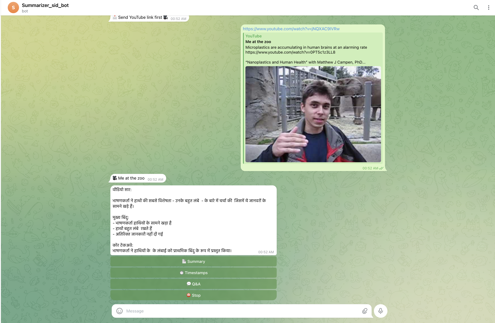
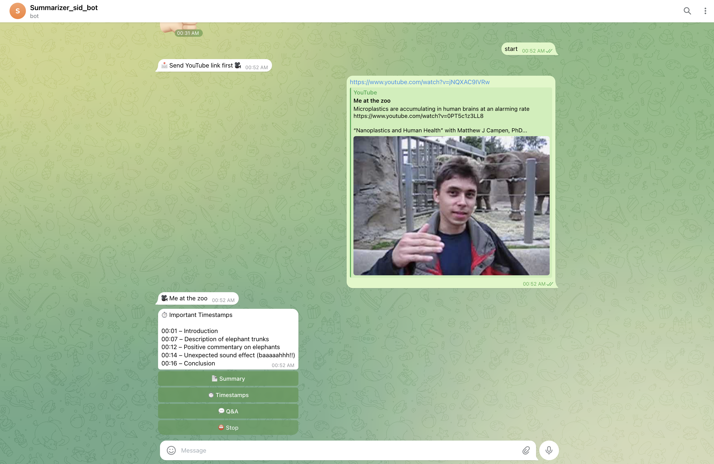

# 📺 Telegram YouTube Summarizer & Q&A Bot

### Built with OpenClaw \| Eywa SDE Intern Assignment

------------------------------------------------------------------------

## 🚀 Objective

This project implements a Telegram-based AI assistant using **OpenClaw**
that:

1.  Accepts a YouTube link\
2.  Fetches the video transcript\
3.  Generates a structured summary\
4.  Enables contextual Q&A\
5.  Supports English and Hindi

The system behaves like a **personal AI research assistant for YouTube
content**, allowing users to quickly understand long videos and extract
insights.

------------------------------------------------------------------------

# 🧠 System Architecture

User → Telegram Bot → OpenClaw Skill Layer\
↓\
Transcript Fetcher\
↓\
Language Detection\
↓\
Adaptive Transcript Chunking\
↓\
Embedding Generation (RAG)\
↓\
Hybrid Semantic Retrieval Layer\
↓\
LLM Processing via OpenClaw\
↓\
Structured Output

------------------------------------------------------------------------

# 🛠 Tech Stack

-   **OpenClaw (Local AI Orchestration Layer)**
-   Python 3.10 / 3.11
-   python-telegram-bot (async)
-   youtube-transcript-api
-   Ollama (local runtime)
-   llama3 (LLM reasoning)
-   nomic-embed-text (embeddings)
-   NumPy (vector similarity)
-   python-dotenv

------------------------------------------------------------------------

# 🎯 Core Features

## 📄 Structured Video Summary

For any valid YouTube link, the bot generates:

-   🎥 Video Title\
-   📌 5 Key Points\
-   ⏱ Important Timestamps\
-   🧠 Core Takeaway

The summary is structured, concise, and business-focused.

------------------------------------------------------------------------

## 💬 Contextual Q&A (Grounded Retrieval)

Users can ask follow-up questions such as:

"What did he say about pricing?"

The system:

-   Uses semantic embeddings
-   Applies hybrid scoring
-   Retrieves relevant transcript chunks
-   Responds strictly from transcript context

If content is not present:

This topic is not covered in the video.

------------------------------------------------------------------------

## 🌍 Multi-language Support

Supported Languages:

-   English (default)
-   Hindi (Devanagari)

Capabilities:

-   Automatic transcript language detection
-   English ↔ Hindi translation pipeline
-   Summary and Q&A in requested language

------------------------------------------------------------------------

# ⚙️ Architectural Decisions

## Transcript Storage

-   In-memory session cache
-   Prevents repeated transcript fetching
-   Memory-safe limits applied

## Adaptive Chunking

-   \< 2000 words → 800-word chunks

-   2000--6000 words → 1200-word chunks

-   6000 words → 1600-word chunks

## Hybrid Retrieval Formula

Final Score =\
(Cosine Similarity × 5) +\
(TF-IDF Score × 2) +\
Bigram Boost +\
Phrase Boost +\
Position Boost

------------------------------------------------------------------------

# 📸 Working Examples

## Summary (Hindi Output)

## Important Timestamps (English Output)

------------------------------------------------------------------------

# 📦 Setup Instructions

## 1. Install OpenClaw

Install OpenClaw locally and ensure skill integration is enabled.

## 2. Clone Repository

git clone `<repository-url>`{=html}\
cd `<repository-folder>`{=html}

## 3. Create Virtual Environment

python3.11 -m venv venv\
source venv/bin/activate

## 4. Install Dependencies

pip install -r requirements.txt

## 5. Install Ollama Models

ollama pull llama3\
ollama pull nomic-embed-text

## 6. Configure Environment

Create `.env` file:

TELEGRAM_BOT_TOKEN=your_token_here

------------------------------------------------------------------------

# ▶️ Running the System

Start Ollama:

ollama serve

In another terminal:

source venv/bin/activate\
python bot.py

------------------------------------------------------------------------

# 🧪 User Flow

1.  User sends YouTube link\
2.  Bot returns structured summary\
3.  User asks follow-up questions\
4.  Bot responds contextually\
5.  User can request Hindi output

------------------------------------------------------------------------

# 🚨 Edge Cases Handled

-   Invalid YouTube URL
-   Missing transcript
-   Non-English transcript
-   Very long videos
-   Multiple simultaneous users
-   Graceful error handling

------------------------------------------------------------------------

# 📊 Evaluation Mapping

End-to-end functionality ✔\
Structured summary quality ✔\
Accurate contextual Q&A ✔\
Multi-language support ✔\
Clean architecture ✔\
Robust error handling ✔

------------------------------------------------------------------------

# 💡 Bonus Features

-   Transcript caching
-   Adaptive chunking
-   Hybrid retrieval scoring
-   Clean session management

------------------------------------------------------------------------

# 📄 License

MIT License
